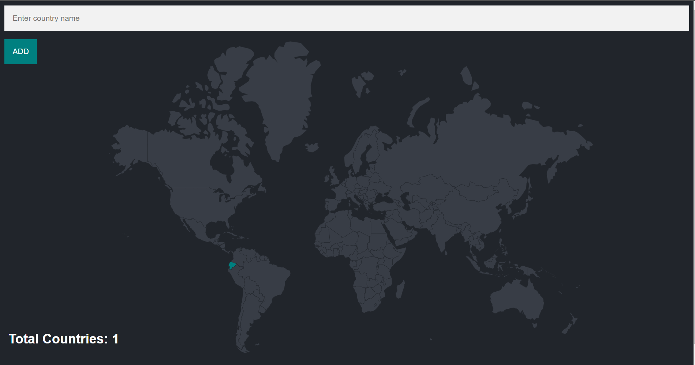
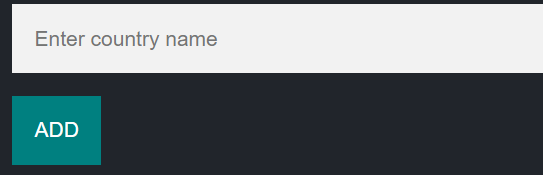
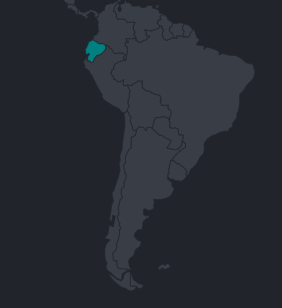
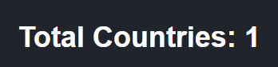

# MAPS

## Tabla de Contenidos

- [Inicio Rápido](#inicio-rápido)
- [Características](#características)
- [Requisitos del Sistema](#requisitos-del-sistema)
- [Instalación](#instalación)
- [Configuración](#configuración)

Esta aplicacion web utiliza un backend para generar y completar y llenar los campos de los paises segun el que escribas,

Tiene un input para poder ingresar el pais que quieres que se pinte.

Asi se ve pintado

Tiene un contador para poder ver cuantos paises has visitado.

### CONFIGURACION

- Clonar
- npm i
- npm run dev
- Tener una base llamada world en postgressSQL y una tabla llamada visited_countries
